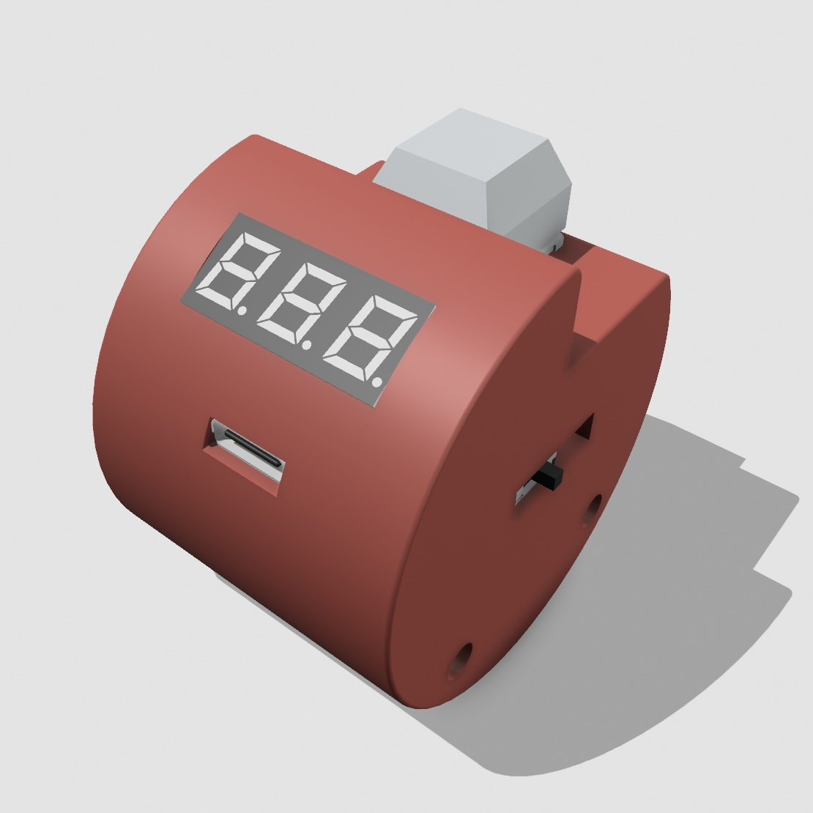
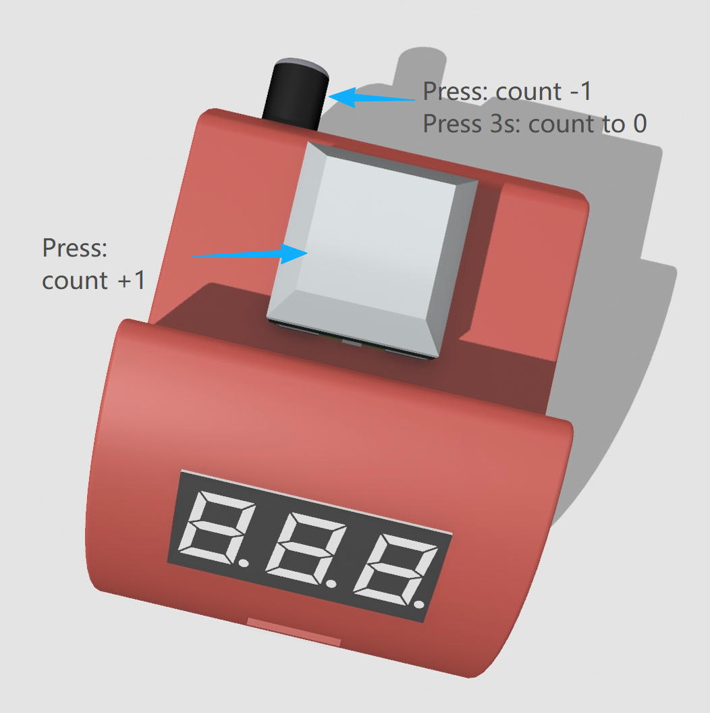

# FT Engine ハードウェア設定ガイド

このガイドでは、カウンターデバイスの端子、インジケーター、採点ボタン、および FT Engine 上での動作対応を説明します。

## 1. Type-C ポート

Type-C ポートは、デバイスの充電、および PC との有線接続に使用します。データケーブルで PC に接続すると、FT Engine のデバイス紐付け画面でデバイスコードを識別できます。

補足:

1. PC にデバイスを識別させる場合は、データ通信に対応したケーブルを使用してください。
2. ケーブルを挿すと、充電状態に入ったときに赤色 LED が点灯します。

---

## 2. 充電状態とバッテリー表示

デバイスは、1 つの赤色 LED と 2 つの緑色 LED で充電状態とバッテリー残量を表示します。

インジケーターの意味:

1. 赤色 LED 点灯: 充電中です。
2. 赤色 LED 消灯: 充電完了です。
3. 2 つの緑色 LED: 現在のバッテリー残量を示します。
4. 緑色 LED が両方点灯: バッテリー残量は十分です。
5. 緑色 LED がすべて消灯: バッテリー残量が少なくなっています。まだ一部の電量は残っていますが、できるだけ早く充電してください。

---

## 3. カウント操作

キースイッチは加点カウントに使用します。黒色ボタンは減点カウント、またはデバイス側カウントのリセットに使用します。

ハードウェア操作:

1. キースイッチを軽く押す: `+1`。
2. 黒色ボタンを軽く押す: `-1`。
3. 黒色ボタンを 3 秒間長押しする: デバイス側のカウントを `0` にリセットします。

---

## 4. FT Engine での対応関係

FT Engine で各審判にデバイスを接続する場合、採点動作は `単一デバイス` と `デュアルデバイス` のどちらを選ぶかで変わります。

**単一デバイス**

1. キースイッチ: スコア `+1`。
2. 黒色ボタン: スコア `-1`。

**デュアルデバイス**

1. 1 台を主デバイス / 加点用デバイスとして選択します。
2. もう 1 台を副デバイス / 減点用デバイスとして選択します。
3. 加点用デバイスのキースイッチ: スコア `+1`。
4. 減点用デバイスのキースイッチ: スコア `-1`。
5. どちらのデバイスでも、黒色ボタン: 重大減点 `-1`。

FT Engine 上では、デュアルデバイスモードの `+` は主デバイスのキースイッチ、`-` は副デバイスのキースイッチ、`重大減点` は両方のデバイスの黒色ボタンから記録されます。

---

## 5. 表示範囲

カウンター本体の表示範囲は `-99` から `999` までです。これはハードウェア上の表示範囲に限られます。FT Engine のソフトウェア側では、この範囲に制限されずに計数を保持します。
