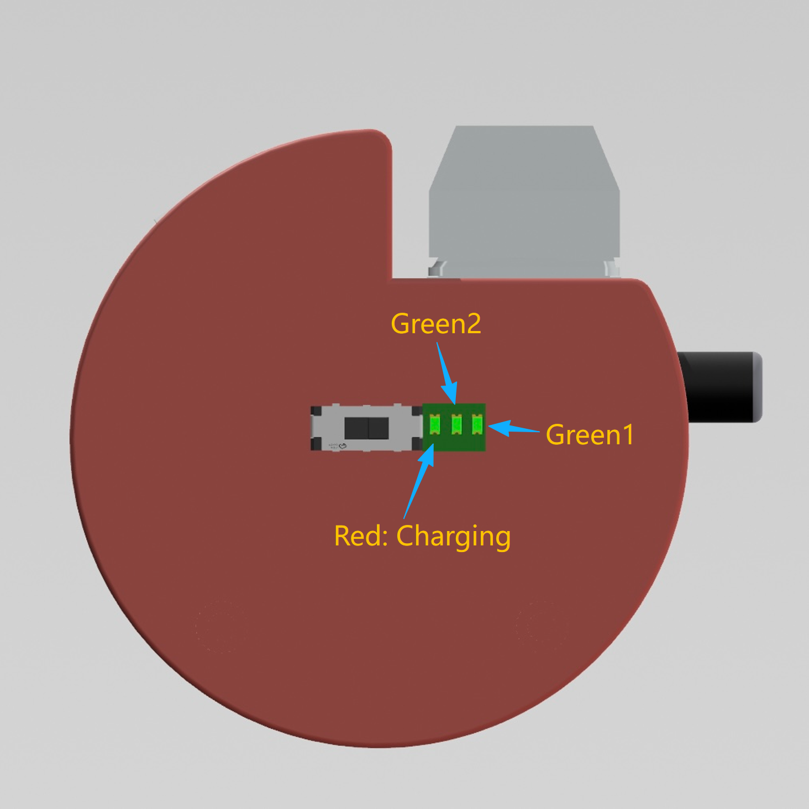

# FT Engine 硬件设置使用手册

本文档用于说明计数器设备的接口、指示灯、计数按键，以及这些硬件操作在 FT Engine 中的对应关系。

## 1. Type-C 接口

Type-C 接口用于对设备进行充电，也可以通过数据线连接到电脑进行有线连接。连接到电脑后，FT Engine 可以在设备绑定流程中识别设备码。

说明：

1. 如果需要电脑识别设备，请使用支持数据传输的数据线。
2. 插入数据线后，设备进入充电状态时红色 LED 灯会亮起。

---

## 2. 充电与电量指示灯

设备通过 1 个红色 LED 和 2 个绿色 LED 显示充电状态与当前电量。

指示灯含义：

1. 红色 LED 亮起：设备正在充电。
2. 红色 LED 熄灭：设备电量已充满。
3. 两个绿色 LED：用于表示当前电量。
4. 两个绿色 LED 全亮：电量充足。
5. 所有绿色 LED 熄灭：电量即将耗尽。此时仍然可能剩余部分电量，但需要尽快充电。

---

## 3. 计数按键

键轴用于正分计数。上方黑色按钮用于负分计数，或将设备计数置零。

硬件操作：

1. 轻触按下键轴：计数 `+1`。
2. 轻触按下黑色按钮：计数 `-1`。
3. 长按黑色按钮 3 秒：将设备计数置零。

---

## 4. FT Engine 中的计分对应关系

在 FT Engine 中为每位裁判连接设备时，计分方式取决于该裁判选择 `单机` 还是 `双机`。

**单机**

1. 键轴触发：分数 `+1`。
2. 黑色按钮触发：分数 `-1`。

**双机**

1. 选择一台设备作为主设备 / 正分设备。
2. 选择另一台设备作为副设备 / 负分设备。
3. 正分设备的键轴触发：分数 `+1`。
4. 负分设备的键轴触发：分数 `-1`。
5. 任意一台设备的黑色按钮触发：重点扣分 `-1`。

在 FT Engine 的数据逻辑中，双机模式下的 `+` 来自主设备键轴，`-` 来自副设备键轴，`重点扣分` 来自主设备和副设备的黑色按钮。

---

## 5. 硬件显示范围

计数器的硬件显示范围为 `-99` 至 `999`。该范围仅代表硬件屏幕可显示的范围；FT Engine 软件内的计数不受此范围限制，会继续保持完整计数。
